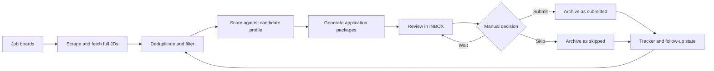

# Job Hunting Automation

A local job-search and application-packaging system I built for my own search.

It finds roles, filters out obvious mismatches, scores the remaining jobs against my profile, generates a tailored CV and cover letter, renders PDFs, and keeps a review queue so I can decide what to submit. The goal is not to spam applications. The goal is to make a careful job search repeatable.

## Why I built this

Most job search work is repetitive but still needs judgment:

- checking the same boards every day
- skipping roles that are too senior, off-track, or location-locked
- reading the full job description instead of trusting a title
- tailoring a resume without making false claims
- remembering what was submitted, skipped, rejected, or still needs follow-up

This repo turns that workflow into a pipeline. Python handles the deterministic parts. Browser automation collects job data. Agent subagents handle judgment-heavy writing and scoring, with guardrails that force everything back to a verified candidate profile.

## What it does

There are two main workflows.

### 1. One-off application package

Given a job description or application URL, the system can create a complete local package:

```text
applications/active/{Company}/
  research/
    job-description.md
    analysis.md
  documents/
    resume.json
    resume.pdf
    cover-letter.md
    cover-letter.pdf
```

The package includes:

- the original job description
- role analysis and match notes
- a tailored Reactive Resume JSON file
- a rendered resume PDF
- a tailored cover letter
- a rendered cover letter PDF
- an entry in `applications/application-tracker.json`
- a row in `applications/INBOX.md` for review

### 2. Job research pipeline

The pipeline does the weekly/daily search loop:



I review the final `INBOX.md` manually before submitting anything.

## Design principles

- **Truth first.** `templates/base-resume.json` and `LinkedIn-CV-Profile.md` are the sources of truth. The system should never invent experience just to match a job.
- **Filter early.** Cheap filters run before LLM scoring: duplicate detection, skipped jobs, seniority/title hard drops, company hard drops, and location checks.
- **Use the full JD.** Scoring happens against fetched full job descriptions, not just snippets from job cards.
- **Keep humans in the loop.** The system prepares packages and queues them. It does not silently submit applications.
- **Make state visible.** The tracker and INBOX make it easy to see active, submitted, rejected, withdrawn, skipped, and follow-up items.

## Repository map

```text
templates/
  base-resume.json              # source of truth for resume data
  cover-letter.md               # cover-letter scaffold and writing rules
  analysis-template.md          # role-analysis scaffold
  quality-framework.md          # truthfulness and quality checklist
  json-resume-guide.md          # Reactive Resume format notes

tools/
  pipeline.py                   # job research pipeline orchestrator
  apply.py                      # one-off application package builder
  resume.py                     # tailored resume generator
  match_score.py                # deterministic JD keyword score
  ats_check.py                  # resume/JD keyword coverage check
  cover_letter_pdf.py           # Typst cover-letter rendering
  reactive_resume.py            # optional Reactive Resume API client
  outreach.py                   # post-submit outreach queue tooling
  status.py                     # tracker/PDF status summary
  lib/                          # shared workflow, tracker, scraper, PDF, validation code

applications/
  INBOX.md                      # manual review queue
  application-tracker.json      # structured application state
  active/                       # packages still under review or in progress
  archive/                      # submitted, rejected, withdrawn, and skipped packages

.agents/skills/
  job-research/                 # orchestration instructions for the pipeline
  job-applier/                  # one-off application workflow
  linkedin/                     # LinkedIn profile/job scraping helpers
```

## The job-search pipeline in detail

### Phase 1: Reconcile the review queue

Before scraping, the pipeline reads `applications/INBOX.md`.

Rows marked `[x]` are treated as submitted. Rows marked `[~]` are treated as skipped. The reconcile step archives those packages, updates the tracker, and keeps the active queue clean.

This gives me a simple workflow:

```markdown
- [ ] still deciding
- [x] submitted
- [~] not interested
```

### Phase 2: Scrape job boards

The pipeline can scrape multiple sources:

- LinkedIn
- Seek
- Hiring.cafe
- Working Nomads
- Wellfound
- We Work Remotely
- Prosple

Search profiles live in `tools/search-config.json`. The current profiles are:

- `product-engineer`: software engineer, software developer, full stack, frontend, backend, product engineer, web engineer, application developer
- `ai-native`: AI engineer, AI application engineer, LLM engineer, applied AI engineer, machine learning engineer

Example:

```bash
python3 tools/pipeline.py \
  --scrape-only /tmp/jobhunting-listings.json \
  --profile product-engineer \
  --profile ai-native
```

### Phase 3: Deduplicate and trim obvious misses

The scraper output is deduplicated across keywords and sources.

Then the pipeline removes roles that are not worth spending LLM/scoring time on. Examples include:

- already seen jobs
- jobs previously marked as skipped
- senior, lead, principal, staff, director, or manager roles
- DevOps/SRE/platform/security/QA roles when they are off-track
- location-limited jobs outside NZ/AU/APAC or global remote
- known low-signal companies or training-data style jobs

This matters because it keeps the expensive judgment step focused on plausible roles.

### Phase 4: Fetch the full job description

For every surviving listing, the pipeline fetches the full JD and stores it in the scrape dump.

That dump looks roughly like this:

```json
{
  "listings": [
    {
      "job_id": "...",
      "source": "seek",
      "title": "Full Stack Developer",
      "company": "ExampleCo",
      "url": "https://...",
      "full_jd": "Full job description text..."
    }
  ],
  "profile_summary": "Candidate profile summary..."
}
```

Fetching the full JD early avoids a common job-search bug: making decisions from card snippets.

### Phase 5: Location gate

The location gate checks the full JD for hard location or work-authorisation constraints.

It keeps roles that are:

- Auckland-based
- New Zealand based
- Australia/NZ friendly
- APAC friendly
- globally remote

It drops roles that clearly require US, Canada, Europe, EMEA, LATAM, clearance, or non-NZ/AU work authorisation.

### Phase 6: Score with a rubric

The scoring step is done by an Agent subagent using `tools/scoring-rubric.md`.

The rubric is intentionally opinionated. It scores for a junior-to-intermediate Auckland-based full-stack / AI engineer, with two tracks:

- product engineering: TypeScript, React, Node, Python, FastAPI, Next.js, SaaS/startups/product teams
- AI-native engineering: LLM apps, agents, RAG, AI integration, applied AI tooling

The subagent writes `/tmp/jobhunting-scores.json`:

```json
{
  "cap": 100,
  "scores": [
    {
      "job_id": "...",
      "source": "seek",
      "title": "AI Software Developer",
      "company": "ExampleCo",
      "url": "https://...",
      "score": 82,
      "reason": "Strong AI product fit"
    }
  ]
}
```

Only roles scoring at or above the cutoff are packaged.

### Phase 7: Build application packages

The packaging step joins the score file back to the scraped listings, reusing the already-fetched full JDs.

```bash
python3 tools/pipeline.py \
  --from-scores /tmp/jobhunting-scores.json \
  --listings /tmp/jobhunting-listings.json \
  --cap 100
```

For each selected role, it creates:

- `research/job-description.md`
- `research/analysis.md`
- `documents/resume.json`
- `documents/resume.pdf`
- `documents/cover-letter.md` scaffold
- tracker entry
- INBOX row

### Phase 8: Fill cover letters

The package step creates a scaffold. A separate subagent fills the cover letter using:

- the job description
- the analysis file
- the tailored resume
- `templates/base-resume.json`
- `LinkedIn-CV-Profile.md`
- `templates/quality-framework.md`

The rules are strict:

- 200-400 words
- 3 paragraphs
- no invented experience
- no unsupported technologies
- no unresolved placeholders
- tone matched to the role

### Phase 9: Render PDFs

Once the markdown cover letters are filled, Typst renders PDFs:

```bash
python3 tools/cover_letter_pdf.py \
  --queue /tmp/jobhunting-cover-queue.json \
  --force
```

The resume PDF is rendered during package creation.

### Phase 10: Review and submit manually

The final output lands in `applications/INBOX.md`:

```markdown
- [ ] **AI Software Developer** @ ExampleCo (score: 82) · [JD](...) · [CV](...) · [Letter](...) · [Apply ↗](...)
```

I review the package, open the application link, and submit manually.

After submitting, I mark the row `[x]`. If I decide not to apply, I mark it `[~]`. The next pipeline run archives it and updates the tracker.

## One-off application flow

For a manually found job, save the JD and run:

```bash
python3 tools/apply.py \
  --job job.md \
  --company "ExampleCo" \
  --position "Full Stack Developer" \
  --role fullstack \
  --keywords React TypeScript Python AI \
  --priority Medium
```

Before packaging, I usually run the deterministic score:

```bash
python3 tools/match_score.py \
  --jd job.md \
  --required "React" "TypeScript" "Python" \
  --preferred "AWS" "LLM"
```

The score is deliberately simple. It catches exact keyword gaps, but I still review adjacent experience manually. For example, Azure can be adjacent to AWS, and OpenAI Agent SDK experience can be adjacent to LangGraph, but the system should not claim exact experience unless it is verified.

## Tracker and INBOX workflow

`applications/application-tracker.json` stores structured state:

- active applications
- interviews
- offers
- rejected applications
- withdrawn applications
- seen jobs by source
- skipped jobs

`applications/INBOX.md` is the human-facing queue. It is intentionally plain Markdown because that makes review fast.

Example row:

```markdown
- [ ] **Frontend Engineer** @ ExampleCo (score: 78) · [JD](./active/ExampleCo/research/job-description.md) · [CV](./active/ExampleCo/documents/resume.pdf) · [Letter](./active/ExampleCo/documents/cover-letter.md) · [Apply ↗](https://example.com/job)
```

The checkbox is the interface.

## Outreach support

The repo also supports post-submit outreach.

When a submitted package is archived, the outreach tools can prepare a queue, discover contacts, and scaffold a cold email. A per-company subagent can then validate the contact and write a role-aware email.

Typical commands:

```bash
python3 tools/outreach.py list-submitted
python3 tools/outreach.py prepare --pick 3 16 --output /tmp/jobhunting-outreach-queue.json
python3 tools/outreach.py run --pick 3 16 --output /tmp/jobhunting-outreach-queue.json
```

The same truthfulness rule applies: no invented contacts, no fake relationship, no inflated claims.

## Quality and truthfulness checks

The system uses `templates/quality-framework.md` as the final gate.

Every generated package should pass:

- experience matches the source profile
- projects and employers are real
- technologies are supported by `base-resume.json` or `LinkedIn-CV-Profile.md`
- cover letters have no placeholders
- resume PDFs render correctly
- ATS keywords are included only when truthful

A useful check for resume/JD coverage:

```bash
python3 tools/ats_check.py \
  --resume applications/active/ExampleCo/documents/resume.json \
  --jd applications/active/ExampleCo/research/job-description.md \
  --critical "React" "TypeScript" "Python"
```

If a keyword is missing because it is not truthful, I leave it missing. The cover letter can position adjacent experience, but the resume should not fake exact matches.

## Browser setup

Some scrapers use `browser-harness` to control Chrome through the Chrome DevTools Protocol. This lets the scraper use a real browser session for sites like LinkedIn.

Install:

```bash
npm install -g browser-harness
```

Start Chrome with remote debugging:

```bash
/Applications/Google\ Chrome.app/Contents/MacOS/Google\ Chrome \
  --remote-debugging-port=9222 \
  --user-data-dir="$HOME/.chrome-jobhunting"
```

Verify CDP:

```text
http://localhost:9222/json/version
```

Verify `browser-harness`:

```bash
browser-harness <<'PY'
print(list_tabs())
PY
```

Then smoke test one source:

```bash
python3 tools/pipeline.py \
  --dry-run \
  --source linkedin \
  --scrape-only /tmp/linkedin.json
```

## Useful commands

Run the full scrape/prep stage:

```bash
python3 tools/pipeline.py --scrape-only /tmp/jobhunting-listings.json
```

Package scored roles:

```bash
python3 tools/pipeline.py \
  --from-scores /tmp/jobhunting-scores.json \
  --listings /tmp/jobhunting-listings.json \
  --cap 100
```

Render cover letters:

```bash
python3 tools/cover_letter_pdf.py --queue /tmp/jobhunting-cover-queue.json --force
```

Check status:

```bash
python3 tools/status.py
```

Generate a resume only:

```bash
python3 tools/resume.py \
  --company "ExampleCo" \
  --role fullstack \
  --keywords React TypeScript Python
```

Optional Reactive Resume push:

```bash
python3 tools/reactive_resume.py push \
  --file applications/active/ExampleCo/documents/resume.json \
  --name "ExampleCo - Full Stack Developer" \
  --slug "exampleco-full-stack" \
  --tags active fullstack \
  --dry-run
```

Archive cleanup:

```bash
./tools/cleanup-archive.sh
```

## Requirements

- Python 3
- `typst` for PDF rendering
- `browser-harness` for browser-backed scraping
- Chrome or Chromium with CDP enabled for authenticated boards
- Optional: Reactive Resume API credentials for server sync

Install Typst on macOS:

```bash
brew install typst
```

## Tests

```bash
python3 -m pytest
```

## What this demonstrates

This project is a practical example of agentic workflow design:

- deterministic Python orchestration around non-deterministic LLM steps
- browser automation for messy real-world data collection
- structured state management for a long-running personal workflow
- human review gates instead of blind automation
- truthfulness constraints for generated writing
- PDF/document generation from structured resume data
- deduplication and scoring to reduce noise before spending LLM tokens

It is intentionally local-first and file-based. The system is easy to inspect, easy to correct, and hard to let run away without me noticing.
